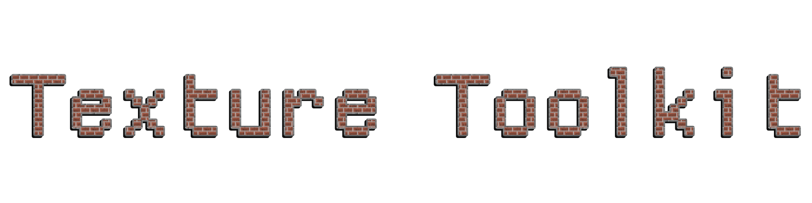

<p align="center">
  
</p>

Texture Toolkit dumps and replaces textures at runtime in 32-bit and 64-bit Direct3D 9 and Direct3D 11 games on Windows. It loads as an `.asi` plugin through Ultimate ASI Loader, or as a proxy DLL renamed to `dinput8.dll`, `d3d9.dll`, or `dxgi.dll`. An in-game panel lists the textures in the current scene, shows their format and memory size, and lets you dump or replace them without restarting. It has been tested against Bully: Scholarship Edition (Direct3D 9), Grand Theft Auto IV: Complete Edition (Direct3D 9), and Need for Speed: The Run (Direct3D 11).

## How it works

Texture Toolkit hooks the calls that create and upload textures: `LockRect`/`UnlockRect` on D3D9, and `Map`/`Unmap` plus `CreateTexture2D` on D3D11. When a texture's pixels are uploaded it computes a CRC32 over that data and writes the hash onto the resource as D3D private data. At draw time it reads the hash back from whatever texture the game binds (`SetTexture` on D3D9, `PSSetShaderResources` on D3D11); if a replacement exists for that hash, it substitutes it before the draw.

Storing the hash on the resource, instead of tracking raw pointers, keeps a replacement attached to the right texture after the driver frees an address and reuses it for something else. On D3D9 the tool also follows `UpdateTexture`, so art that the game loads into a `SYSTEMMEM` texture and copies into a `DEFAULT`-pool texture is matched by the copy the game actually renders.

## Features

- Direct3D 9 and Direct3D 11, both x86 and x64.
- DDS replacement: put `<hash>.dds` in `TT/inject` and it loads without a restart.
- Mip handling: a replacement is created with the original texture's mip count. Missing mips are generated for uncompressed formats; a compressed replacement without a full chain loads at its top level and logs a warning.
- Dumping to `TT/dump` as `.dds`: automatically on load, one at a time from the panel, or every tracked texture at once.
- CRC32 content hashing, so two identical textures share one hash and one replacement.
- Input isolation and a software cursor, so the game stops reading the mouse and keyboard while the panel is open.

## The in-game panel

Press `INSERT` to open it. The left pane lists tracked textures with hash, size, mip count, format, and status (original, dumped, or injected). The filter box matches on hash, dimensions, or format. Hover the list and press `[` or `]` to step through it.

The right pane inspects the selected texture. The preview shows the injected replacement, the live original while it is on screen, or the dumped `.dds` read back from disk. Below it are the dimensions, mip count, data size, format, the compressed and sRGB flags, and the D3D11 bind, usage, and misc flags. You can copy the hash or dump the texture from here, and drag the divider to resize the two panes.

## Building

Requires CMake 3.20 or newer and a Visual Studio toolchain with the Windows SDK. The build expects Dear ImGui, MinHook, and stb under a sibling `../reshade/deps` directory and ReShade's headers under `../reshade/include`; the exact paths are at the top of `CMakeLists.txt`.

### 32-bit (x86)

```cmd
cmake -B build32 -A Win32
cmake --build build32 --config Release
```

Output: `build32/Release/TextureToolkit.asi`.

### 64-bit (x64)

```cmd
cmake -B build64 -A x64
cmake --build build64 --config Release
```

Output: `build64/Release/TextureToolkit.asi`.

Match the build to the game: a 32-bit game needs the x86 build.

## Installing

1. Copy `TextureToolkit.asi` into the game folder, or into a `plugins/` or `scripts/` folder when using Ultimate ASI Loader. To load it as a proxy instead, rename it to `dinput8.dll`, `d3d9.dll`, or `dxgi.dll`.
2. Launch the game. Texture Toolkit creates a `TT/` folder next to the executable containing `dump/`, `inject/`, a log, and `TextureToolkit.ini`.
3. Press `INSERT` to open the panel.

To replace a texture, read its hash from the panel (or dump it first), edit the `.dds`, and place it in `TT/inject` named after the hash, for example `5D3E2CCE.dds` or `0x5D3E2CCE.dds`. Export it with a full mip chain if it is block-compressed.

## Configuration

`TT/TextureToolkit.ini` is created on first run:

```ini
[TextureToolkit]
HotKey=0x2D
DumpDir=TT/dump
InjectDir=TT/inject
EnableInjection=1
AutoDump=0
FilterSmallTextures=1
ShowCurrentFrameOnly=0
ShowOSDBanner=1
Verbose=0
```

- `HotKey`: virtual-key code that toggles the panel (`0x2D` INSERT, `0x24` HOME, `0x74` F5).
- `DumpDir` / `InjectDir`: relative to the game folder, or an absolute path.
- `EnableInjection`: load replacements from `InjectDir`.
- `AutoDump`: dump every texture to `DumpDir` as it loads.
- `FilterSmallTextures`: ignore textures under 16x16.
- `ShowCurrentFrameOnly`: list only textures drawn in the current scene.
- `ShowOSDBanner`: show the startup banner.
- `Verbose`: write per-texture debug lines to the log; leave off for normal use, since it slows the game.

Toggling a checkbox in the panel writes its new value back to this file.

## Limitations

- Direct3D 9 and Direct3D 11 only. DirectX 8, 10, 12, and Vulkan are not hooked.
- A DirectX 8 game run through a `d3d8to9` wrapper renders as Direct3D 9, so the overlay appears, but its textures stay invisible. The wrapper feeds pixel data into the D3D9 textures through an internal path that never calls a `LockRect`, `UpdateSurface`, `UpdateTexture`, or `StretchRect` we can hook, so there is nothing to hash. Capturing those would require hooking Direct3D 8 directly, which is not implemented. Mafia: The City of Lost Heaven (via the `UseD3D8to9` loader) behaves this way; with `Verbose=1` the log fills with `Hooked_CreateTexture` lines and never a `Tracked` line.
- Injection reads `.dds` only. Dumps are written as `.dds`.
- A D3D9 texture in the default pool cannot be read back with `LockRect`, so the panel's Dump button fails on those; Auto-dump captures them from the upload instead.
- A compressed replacement without a full mip chain samples its top level at every distance, which aliases in motion. The missing mips cannot be regenerated from compressed data, so export those with mipmaps.

## License

MIT. See [LICENSE](LICENSE).
